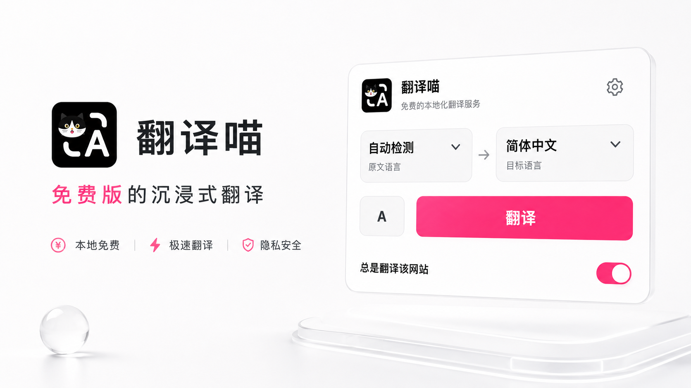
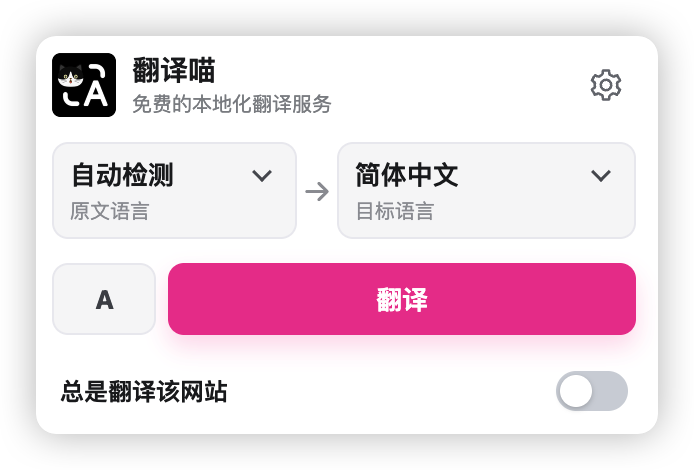

  
  <h1>翻译喵 TransMeow</h1>
  <h3>免费版的沉浸式翻译</h3>
  
使用翻译喵，无需注册账号、充值会员、购买 AI 算力或配置 API Key。

  

  

 

## 快速开始

翻译喵仅支持桌面版 Chrome 138 及以上版本。

### 方式一：从 Chrome 应用商店安装（推荐）

Chrome 应用商店版本即将上线。上线后，点击安装即可自动接收后续更新。

<!-- 商店审核通过后，在这里添加 Chrome 应用商店安装链接。 -->

### 方式二：手动安装

1. [下载最新版翻译喵安装包](https://github.com/ZhuoyuBai/TransMeow/releases/latest/download/TransMeow.zip)。
2. 解压下载的 `TransMeow.zip`。
3. 在 Chrome 地址栏打开 `chrome://extensions`。
4. 打开右上角的“开发者模式”。
5. 点击“加载已解压的扩展程序”。
6. 选择刚刚解压的翻译喵文件夹。

> 手动安装的版本不会自动更新。新版本发布后，需要重新下载安装。

## 为什么选择翻译喵 TransMeow

### 真正免费

翻译喵直接使用 Chrome 自带的翻译模型。无需注册账号、充值会员或购买调用额度，也不会因为翻译次数和字数产生费用。

### 翻译速度更快

语言包下载完成后，网页内容直接在你的电脑上翻译，不需要上传到云端，也不需要等待第三方翻译服务返回结果。

### 隐私更安全

网页内容只在你的电脑上处理，不会发送给翻译喵、Google 或其他第三方翻译服务器。语言设置、网站偏好和翻译缓存也只保存在本机。

[查看完整隐私政策](PRIVACY.md)

> 首次使用某个语言组合时，Chrome 需要下载对应的本地语言包。下载完成后，再次使用该语言组合无需重复下载。

## 免费开源

本项目仅供个人非商业使用。未经作者许可，禁止用于任何商业用途。
