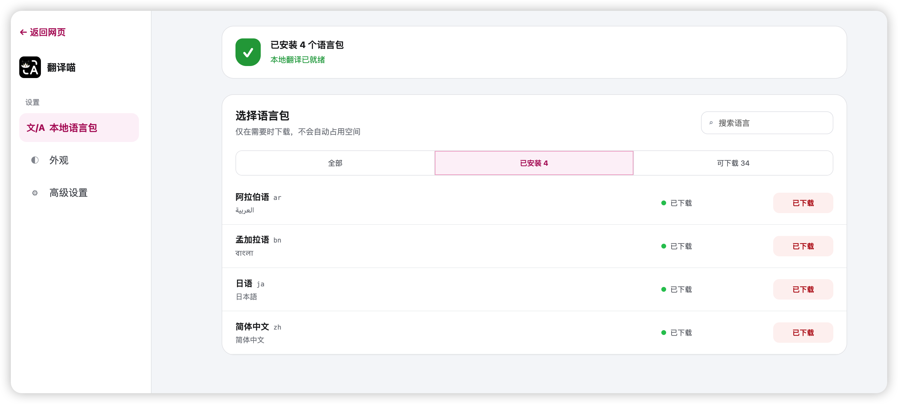
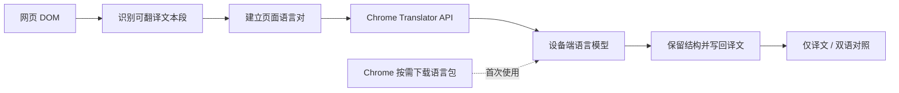

<p align="center">
  
</p>

# 翻译喵 TransMeow

## 免费，快速的本地翻译插件

本地免费，速度更快，隐私更安全。

翻译喵使用桌面版 Chrome 138 及以上版本自带的翻译模型。无需注册账号、充值会员、购买 AI 模型额度或配置 API Key，也不会将网页内容发送到任何第三方服务器。

<p align="center">
  
</p>



## 安装翻译喵

### 方式一：从 Chrome 应用商店安装（推荐）

Chrome 应用商店版本即将上线。上线后，点击安装即可自动接收后续更新。

<!-- 商店审核通过后，在这里添加 Chrome 应用商店安装链接。 -->

### 方式二：手动安装

1. [下载最新版翻译喵安装包](https://github.com/ZhuoyuBai/TransMeow/releases/latest/download/TransMeow.zip)。
2. 解压下载的 `TransMeow.zip`。
3. 在 Chrome 地址栏打开 `chrome://extensions`。
4. 打开右上角的“开发者模式”。
5. 点击“加载已解压的扩展程序”。
6. 选择刚刚解压的翻译喵文件夹。

> 手动安装的版本不会自动更新。新版本发布后，需要重新下载安装。

## 为什么选择翻译喵 TransMeow

### 真正免费

翻译喵直接使用 Chrome 自带的翻译模型。无需注册账号、充值会员或购买调用额度，也不会因为翻译次数和字数产生费用。

### 翻译速度更快

语言包下载完成后，网页内容直接在你的电脑上翻译，不需要上传到云端，也不需要等待第三方翻译服务返回结果。

### 隐私更安全

网页内容只在你的电脑上处理，不会发送给翻译喵、Google 或其他第三方翻译服务器。语言设置、网站偏好和翻译缓存也只保存在本机。

[查看完整隐私政策](PRIVACY.md)

> 首次使用某个语言组合时，Chrome 需要下载对应的本地语言包。下载完成后，再次使用该语言组合无需重复下载。

## 如何使用

1. 打开一个外文网页，点击浏览器工具栏中的翻译喵图标。
2. 原文语言保持“自动检测”，然后选择你想翻译成的语言。
3. 点击左侧的 `A`，选择“仅译文”或“双语对照”。
4. 点击“翻译”。
5. 如果希望以后打开这个网站时自动翻译，开启“总是翻译该网站”。

翻译开始后可以关闭弹窗，翻译会在当前页面继续进行。翻译完成后，再次打开翻译喵即可恢复原文或切换显示模式。

## 主要功能

- **仅译文和双语对照**：可以只看译文，也可以同时保留原文和译文。
- **自动检测原文语言**：打开网页后无需手动判断语言，直接选择目标语言即可。
- **支持 39 种语言**：包括中文、英语、日语、韩语、法语、德语和西班牙语等常用语言。
- **保留原网页排版**：翻译后仍然保留链接、按钮、表格和原有页面结构。
- **支持动态网页**：滚动加载出来的新内容也可以继续翻译，支持 YouTube、Reddit、X 等常见网站。
- **总是翻译该网站**：为常用外文网站开启自动翻译，下次打开时无需再次操作。
- **本地翻译缓存**：已经翻译过的相同内容可以直接使用缓存，减少重复翻译。
- **自定义翻译范围**：可以只翻译当前看到的内容，也可以翻译整个页面。

## 它是如何工作的



扩展把职责分为两层：

- `popup.js` 管理语言、范围、显示模式与翻译入口。
- `content.js` 扫描 DOM、维护 Translator 实例、写回译文，并处理动态页面。
- `background.js` 只负责站点自动翻译调度和扩展图标状态，不参与正文翻译。

文本收集依次使用语义块扫描、通用可视文本块扫描和旧式页面回退策略。复杂富文本会通过内部边界标记尽量一次翻译；如果模型没有完整保留标记，则自动回退到逐文本节点翻译，以页面可恢复性为优先。

## 权限说明

| 权限 | 用途 |
|---|---|
| `scripting` | 在需要时与当前网页的内容脚本通信 |
| `storage` | 保存语言、显示模式、站点规则和本地翻译缓存 |
| `http://*/*` / `https://*/*` | 在普通网页中发现文本并插入译文 |

扩展不支持、也不会尝试在 `chrome://` 页面或 Chrome 应用商店页面运行。

## 兼容性与限制

| 项目 | 当前状态 |
|---|---|
| 桌面版 Chrome 138+ | ✅ 支持 |
| Chromium 内核的其他浏览器 | ⚠️ 取决于是否实现 Translator API |
| Firefox / Safari | ❌ 不支持 |
| Chrome 内部页面 / 应用商店 | ❌ 浏览器限制 |
| PDF、图片与 OCR | ❌ 暂不支持 |
| 视频字幕 | ❌ 暂不支持 |
| 输入框与编辑器内容 | ❌ 暂不支持 |
| 封闭 Shadow DOM | ❌ 网页自身不可访问 |

Chrome 的公开 Translator API 只提供语言包 0–100% 的下载进度，不提供准确的字节大小；因此设置页不会展示未经验证的 MB 估算值。Chrome 当前也没有向扩展开放直接卸载语言包的接口。

## 开发与测试

项目使用原生 ES2022+ JavaScript，没有 npm 依赖、构建系统或打包步骤。修改源码后，只需在 `chrome://extensions` 中点击扩展的刷新按钮。

```text
.
├── manifest.json      # Manifest V3 配置
├── popup.*            # 扩展弹窗与翻译编排入口
├── content.js         # DOM 扫描、翻译与动态页面处理
├── background.js      # 图标状态与站点自动翻译
├── options.*          # 语言包、外观、缓存与站点规则设置
├── languages.js       # Chrome 翻译语言目录
├── i18n.js            # 扩展界面本地化
├── icons/             # 扩展图标
└── tests/             # 浏览器内 HTML 回归测试页
```

启动本地测试服务器：

```bash
python3 -m http.server 8000
```

然后在 Chrome 中打开聚合回归入口：

```text
http://127.0.0.1:8000/tests/run-all.html
```

发布前应显示 `22/22 通过`。也可以单独打开任一 fixture 调试具体场景。
`tests/` 中的 fixtures 覆盖语义扫描、导航原子标签、由多个行内节点拼接的 Hero 标语、缓存写入与页面回放、富文本保留、布局恢复、取消与错误恢复、动态内容、无限滚动、虚拟列表以及性能回归场景。

## 参与贡献

欢迎提交 Issue 和 Pull Request。以下方向尤其适合贡献：

- 补充更多真实网站的最小复现页面。
- 改进复杂富文本、表格和 Web Components 的兼容性。
- 完善自动化浏览器测试与性能基准。
- 改进无障碍体验和界面本地化。
- 在不引入远程正文处理的前提下扩展阅读场景。

提交修改前，请确保：

1. 不破坏原网页 DOM 的可恢复性。
2. 动态内容不会被重复翻译或被旧结果覆盖。
3. 普通动画与样式变化不会触发全页重复扫描。
4. 新行为有对应的 `tests/*.html` 回归页面。

## 常见问题

<details>
<summary><strong>为什么第一次翻译比较慢？</strong></summary>

Chrome 可能需要为首次使用的语言组合下载本地语言包。下载完成后，同一语言组合通常可以直接复用。

</details>

<details>
<summary><strong>翻译时可以关闭扩展弹窗吗？</strong></summary>

可以。Translator 实例和翻译队列由页面内容脚本持有，关闭弹窗不会取消任务。

</details>

<details>
<summary><strong>为什么某些文字没有被翻译？</strong></summary>

扩展会跳过输入框内容、不可见内容、脚本、代码块和浏览器内部页面；导航、筛选器及其他交互控件中的可见叶子标签会在保留交互结构的前提下翻译。封闭 Shadow DOM 仍无法访问。

</details>

<details>
<summary><strong>能卸载已经下载的语言包吗？</strong></summary>

暂时不能。Chrome 尚未向扩展开放直接卸载语言包的公开接口。

</details>

## 致谢

- [Chrome Built-in AI Translator API](https://developer.chrome.com/docs/ai/translator-api) 提供设备端翻译能力。
- 所有参与测试、提交问题和改进网页兼容性的贡献者。

## 开源说明

本项目仅供个人非商业使用。未经作者许可，禁止用于任何商业用途。
