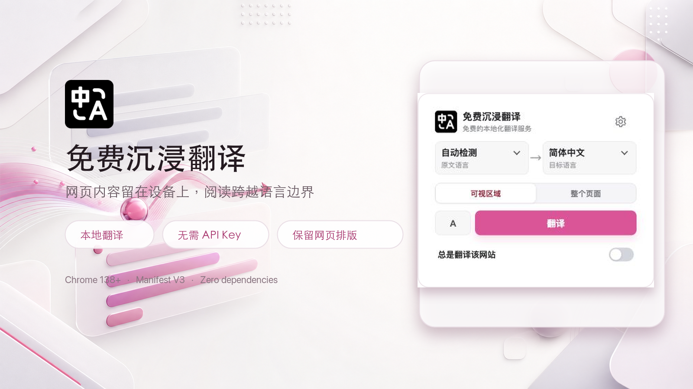
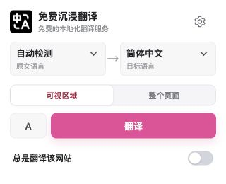
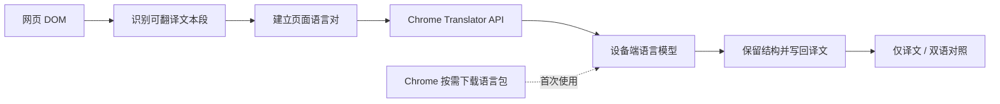

<p align="center">
  
</p>

<h1 align="center">翻译喵 · TransMeow</h1>

<p align="center">
  <strong>不上传网页内容，不需要 API Key。用 Chrome 内置 AI，在本机完成沉浸式网页翻译。</strong>
</p>

<p align="center">
  <a href="#快速开始">快速开始</a> ·
  <a href="#为什么选择翻译喵-transmeow">核心优势</a> ·
  <a href="#它是如何工作的">工作原理</a> ·
  <a href="#开发与测试">参与开发</a>
</p>

<p align="center">
  
  
  
  
  
</p>



## 一句话介绍

翻译喵（TransMeow）是一款基于 [Chrome Translator API](https://developer.chrome.com/docs/ai/translator-api) 的本地网页翻译扩展。它把译文直接放回原网页，保留链接、强调、行内代码和交互结构，并能跟随无限滚动、SPA 导航与动态内容持续翻译。

> [!IMPORTANT]
> 需要桌面版 Chrome 138 或更高版本。首次使用某个语言组合时，Chrome 会按需下载本地语言包；之后的正文翻译在设备上完成。

## 为什么选择翻译喵 TransMeow

| | 翻译喵 TransMeow | 常见云端网页翻译 |
|---|---|---|
| 翻译位置 | Chrome 在本机执行 | 内容发送到远程服务 |
| 使用门槛 | 无需账号、API Key 或额度 | 可能需要登录、密钥或订阅 |
| 阅读体验 | 仅译文 / 双语对照，一键切换 | 常见为整页替换或独立面板 |
| 页面结构 | 保留链接、强调、代码与原有交互 | 复杂富文本可能被打平 |
| 动态网页 | 支持 SPA、无限滚动和虚拟列表 | 视具体服务而定 |
| 工程复杂度 | 原生 JavaScript，零构建依赖 | 通常依赖远程后端或 SDK |

### 隐私优先，而不是隐私口号

- 网页正文不会发送到第三方翻译服务器。
- 翻译由 Chrome 提供的设备端模型执行。
- 站点偏好、界面设置和最多 800 条翻译缓存只保存在 `chrome.storage.local`。
- 当前代码不包含账号系统、分析 SDK、广告或遥测上报。

### 尽量不破坏网页

- 仅译文模式复用原容器，富文本只替换需要翻译的文本节点。
- 双语模式保留标签、链接属性与排版，并移除克隆节点中的重复 `id`。
- 表格译文留在原单元格内，避免破坏列结构。
- 随时恢复原文，原始 DOM 与行内样式会被完整还原。

### 为真实的现代网页而设计

- 支持可视区域优先翻译，也可一次翻译整个页面。
- 将导航栏中的可见叶子链接/按钮作为原子标签翻译，不改动导航容器、图标或点击行为。
- 识别动态插入内容，并在滚动到视口时继续翻译。
- 处理 React / Vue 重渲染、虚拟列表节点复用和旧异步结果回写。
- 针对 YouTube、Reddit、X 的常见内容结构做了兼容。
- 每个 SPA 路由独立维护状态，站内跳转不会串页。

## 快速开始

当前版本采用 Chrome 的“加载已解压扩展程序”方式安装，全程不需要 Node.js 或构建命令。

1. 下载本仓库源码并解压。
2. 在 Chrome 地址栏打开 `chrome://extensions`。
3. 打开右上角的 **开发者模式**。
4. 点击 **加载已解压的扩展程序**。
5. 选择包含 `manifest.json` 的项目目录。
6. 将扩展固定到工具栏，打开任意 `http://` 或 `https://` 网页即可使用。

### 使用方法

1. 点击扩展图标。
2. 保持“自动检测”，或手动指定原文语言。
3. 选择目标语言和翻译范围。
4. 点击“翻译”。
5. 使用左侧模式按钮在 **仅译文** 与 **双语对照** 间切换。

<p align="center">
  
</p>

翻译开始后可以关闭弹窗，任务仍会在当前页面继续执行。扩展图标会显示翻译进度与完成状态。

## 功能一览

- **39 种语言**：覆盖中文、英语、日语、韩语、法语、德语、西班牙语、葡萄牙语等 Chrome 当前支持的语言。
- **页面级语言检测**：从页面正文中选择占比最高的源语言来创建翻译器；所有已识别文本都会送入翻译，不因短词、专有名词或混合语言跳过。
- **两种翻译范围**：优先处理当前可见内容，或翻译整个页面。
- **两种阅读模式**：仅译文、双语对照；恢复原文只需再次点击。
- **本地缓存**：减少相同段落的重复翻译；已翻译页面再次打开时直接回放精确命中的译文，可随时关闭或清空。
- **网站偏好**：为指定站点开启“总是翻译”，规则仅保存在本机；可在高级设置中查看并删除全部站点规则。
- **语言包管理**：独立设置页查看可用状态和下载进度。
- **13 种界面语言**：支持跟随浏览器，或手动切换常用界面语言。
- **开放 Shadow DOM**：除正文与辅助内容区外，也会扫描可访问的开放 Shadow Root。
- **错误隔离**：单段失败不会中断整页任务，旧任务不会覆盖已经更新的内容。

## 它是如何工作的



扩展把职责分为两层：

- `popup.js` 管理语言、范围、显示模式与翻译入口。
- `content.js` 扫描 DOM、维护 Translator 实例、写回译文，并处理动态页面。
- `background.js` 只负责站点自动翻译调度和扩展图标状态，不参与正文翻译。

文本收集依次使用语义块扫描、通用可视文本块扫描和旧式页面回退策略。复杂富文本会通过内部边界标记尽量一次翻译；如果模型没有完整保留标记，则自动回退到逐文本节点翻译，以页面可恢复性为优先。

## 权限说明

| 权限 | 用途 |
|---|---|
| `activeTab` | 读取并控制用户主动打开的当前页面 |
| `scripting` | 在需要时与当前网页的内容脚本通信 |
| `storage` | 保存语言、显示模式、站点规则和本地翻译缓存 |
| `http://*/*` / `https://*/*` | 在普通网页中发现文本并插入译文 |

扩展不支持、也不会尝试在 `chrome://` 页面或 Chrome 应用商店页面运行。

## 兼容性与限制

| 项目 | 当前状态 |
|---|---|
| 桌面版 Chrome 138+ | ✅ 支持 |
| Chromium 内核的其他浏览器 | ⚠️ 取决于是否实现 Translator API |
| Firefox / Safari | ❌ 不支持 |
| Chrome 内部页面 / 应用商店 | ❌ 浏览器限制 |
| PDF、图片与 OCR | ❌ 暂不支持 |
| 视频字幕 | ❌ 暂不支持 |
| 输入框与编辑器内容 | ❌ 暂不支持 |
| 封闭 Shadow DOM | ❌ 网页自身不可访问 |

Chrome 的公开 Translator API 只提供语言包 0–100% 的下载进度，不提供准确的字节大小；因此设置页不会展示未经验证的 MB 估算值。Chrome 当前也没有向扩展开放直接卸载语言包的接口。

## 开发与测试

项目使用原生 ES2022+ JavaScript，没有 npm 依赖、构建系统或打包步骤。修改源码后，只需在 `chrome://extensions` 中点击扩展的刷新按钮。

```text
.
├── manifest.json      # Manifest V3 配置
├── popup.*            # 扩展弹窗与翻译编排入口
├── content.js         # DOM 扫描、翻译与动态页面处理
├── background.js      # 图标状态与站点自动翻译
├── options.*          # 语言包、外观、缓存与站点规则设置
├── languages.js       # Chrome 翻译语言目录
├── i18n.js            # 扩展界面本地化
├── icons/             # 扩展图标
└── tests/             # 浏览器内 HTML 回归测试页
```

启动本地测试服务器：

```bash
python3 -m http.server 8000
```

然后在 Chrome 中打开聚合回归入口：

```text
http://127.0.0.1:8000/tests/run-all.html
```

发布前应显示 `22/22 通过`。也可以单独打开任一 fixture 调试具体场景。
`tests/` 中的 fixtures 覆盖语义扫描、导航原子标签、由多个行内节点拼接的 Hero 标语、缓存写入与页面回放、富文本保留、布局恢复、取消与错误恢复、动态内容、无限滚动、虚拟列表以及性能回归场景。

## 参与贡献

欢迎提交 Issue 和 Pull Request。以下方向尤其适合贡献：

- 补充更多真实网站的最小复现页面。
- 改进复杂富文本、表格和 Web Components 的兼容性。
- 完善自动化浏览器测试与性能基准。
- 改进无障碍体验和界面本地化。
- 在不引入远程正文处理的前提下扩展阅读场景。

提交修改前，请确保：

1. 不破坏原网页 DOM 的可恢复性。
2. 动态内容不会被重复翻译或被旧结果覆盖。
3. 普通动画与样式变化不会触发全页重复扫描。
4. 新行为有对应的 `tests/*.html` 回归页面。

## 常见问题

<details>
<summary><strong>为什么第一次翻译比较慢？</strong></summary>

Chrome 可能需要为首次使用的语言组合下载本地语言包。下载完成后，同一语言组合通常可以直接复用。

</details>

<details>
<summary><strong>翻译时可以关闭扩展弹窗吗？</strong></summary>

可以。Translator 实例和翻译队列由页面内容脚本持有，关闭弹窗不会取消任务。

</details>

<details>
<summary><strong>为什么某些文字没有被翻译？</strong></summary>

扩展会跳过输入框内容、不可见内容、脚本、代码块和浏览器内部页面；导航、筛选器及其他交互控件中的可见叶子标签会在保留交互结构的前提下翻译。封闭 Shadow DOM 仍无法访问。

</details>

<details>
<summary><strong>能卸载已经下载的语言包吗？</strong></summary>

暂时不能。Chrome 尚未向扩展开放直接卸载语言包的公开接口。

</details>

## 致谢

- [Chrome Built-in AI Translator API](https://developer.chrome.com/docs/ai/translator-api) 提供设备端翻译能力。
- 所有参与测试、提交问题和改进网页兼容性的贡献者。

## 许可证

本仓库目前尚未声明开源许可证。在许可证文件补充前，默认著作权规则适用；公开发布前建议由维护者选择并添加合适的 `LICENSE`。
