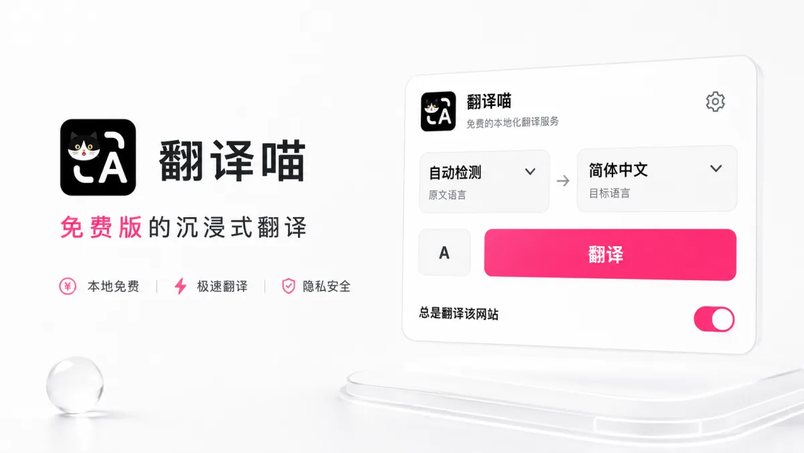
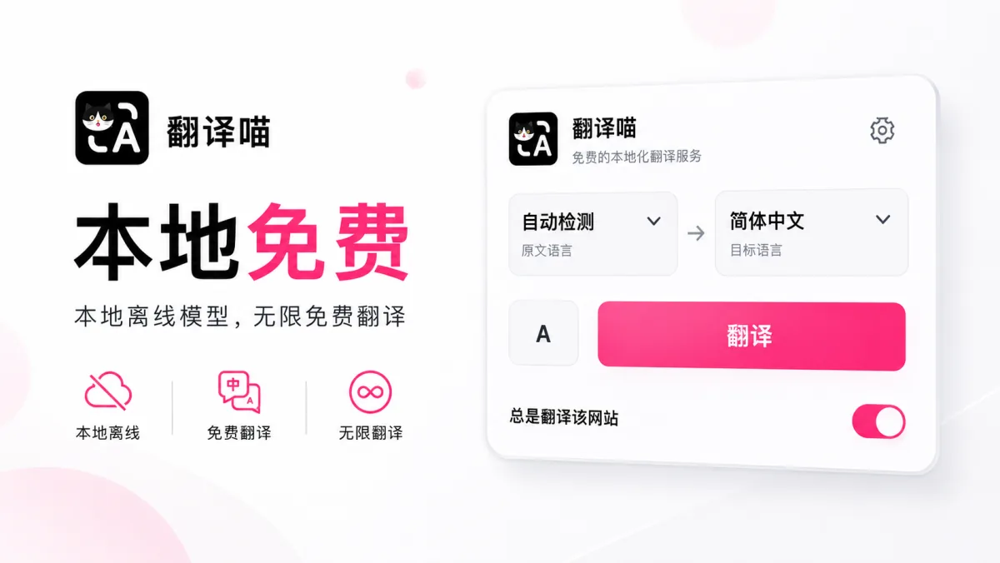
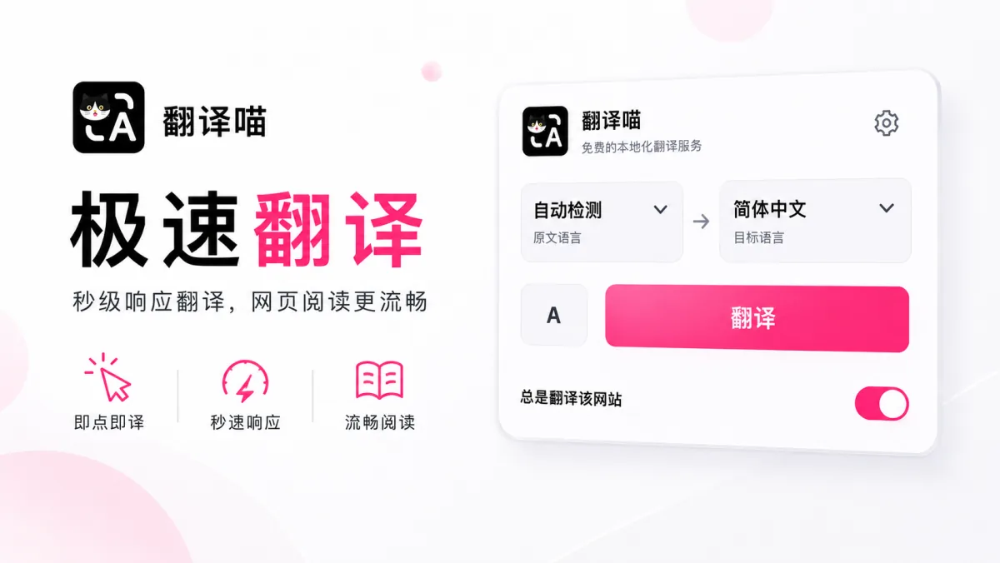
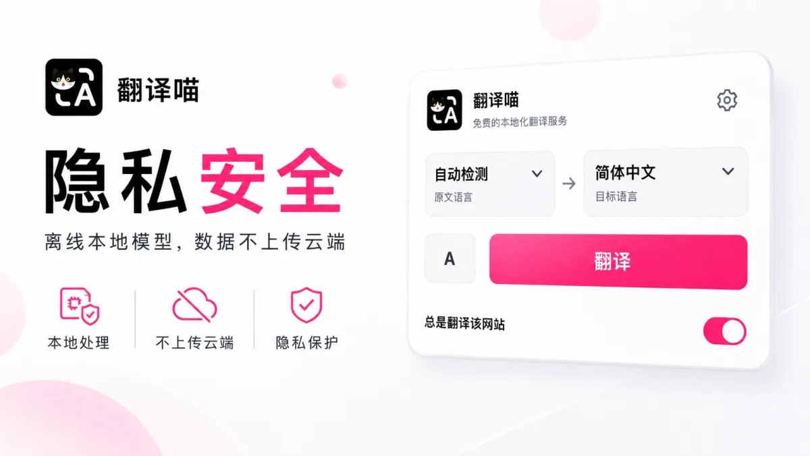
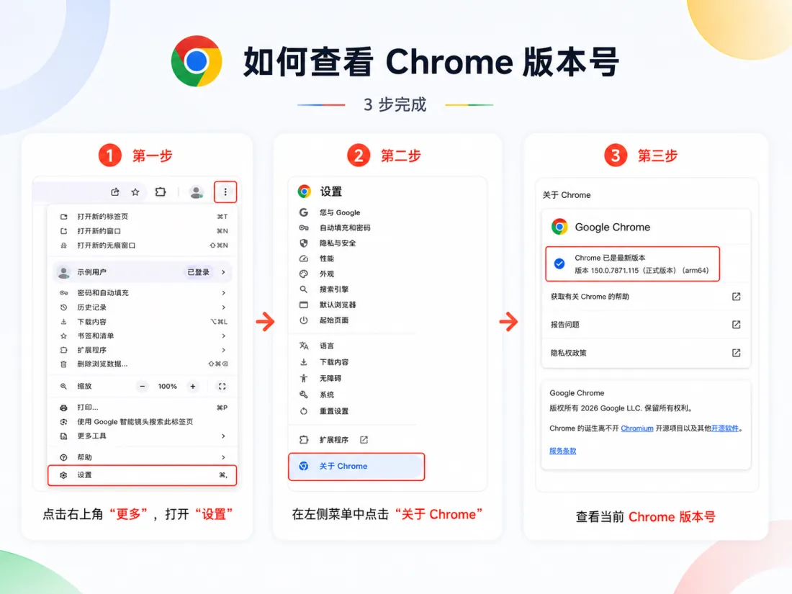

  
  <h1>翻译喵 TransMeow</h1>
  <h3>免费、本地、保护隐私的沉浸式网页翻译</h3>
  
无需注册账号、购买会员、配置 API Key，打开网页即可翻译。

  

## 翻译喵是什么

翻译喵是一款面向桌面版 Chrome 的网页翻译扩展。它使用 Chrome 内置的 Translator API，在你的电脑上完成翻译，并尽量保留网页原有的排版、链接与交互。

- **本地免费**：无需账号、订阅、充值或第三方 API Key。
- **即点即译**：自动检测原文语言，一键翻译当前网页。
- **沉浸阅读**：支持仅译文和双语对照两种显示方式。
- **隐私优先**：网页正文不上传到翻译喵或第三方翻译服务器。
- **持续翻译**：支持动态加载内容，并可为常用网站开启自动翻译。

## 快速开始

> 翻译喵需要 **桌面版 Chrome 138 或更高版本**，暂不支持手机端 Chrome。

### 方式一：从 Chrome 应用商店安装（推荐）

[前往 Chrome 应用商店安装翻译喵](https://chromewebstore.google.com/detail/%E7%BF%BB%E8%AF%91%E5%96%B5/ihmphdhbgmkgcodhnjpbhjojgfpmhinl?hl=zh-CN&utm_source=ext_sidebar)。通过应用商店安装后，可以自动接收后续更新。

### 方式二：手动安装

1. [下载最新版翻译喵安装包](https://github.com/ZhuoyuBai/TransMeow/releases/latest/download/TransMeow.zip)。
2. 解压下载的 `TransMeow.zip`。
3. 在 Chrome 地址栏打开 `chrome://extensions`。
4. 打开右上角的“开发者模式”。
5. 点击“加载已解压的扩展程序”。
6. 选择刚刚解压的翻译喵文件夹。

> 手动安装的版本不会自动更新。新版本发布后，需要重新下载安装。

### 开始翻译

1. 打开需要翻译的网页，点击浏览器工具栏中的翻译喵图标。
2. 保持“自动检测”或手动选择原文语言，再选择目标语言。
3. 点击“翻译”。首次使用某个语言组合时，Chrome 会先下载对应的本地语言包。
4. 点击翻译按钮左侧的显示模式按钮，可在“仅译文”和“双语对照”之间切换。

## 为什么选择翻译喵

### 本地免费，不按字数收费

翻译喵直接调用 Chrome 内置的本地翻译能力。语言包下载完成后，可以反复使用，不限制翻译次数和字数，也不需要购买额外算力。

  

### 极速翻译，阅读少一点等待

网页内容在本机处理，无需等待第三方翻译接口往返；翻译缓存还会帮助已访问内容更快呈现。

  

### 隐私安全，正文不上传云端

网页正文只在你的电脑上处理，不会发送给翻译喵或第三方翻译服务器。语言设置、网站偏好和翻译缓存也保存在本机，并可在高级设置中清理。

  

[查看完整隐私政策](PRIVACY.md)

## 如何确认 Chrome 版本

点击 Chrome 右上角的“更多”按钮，依次进入“设置”→“关于 Chrome”，即可查看当前版本号。版本低于 138 时，请先更新 Chrome 再安装翻译喵。

  

## 使用许可

本项目仅供个人非商业使用。未经作者许可，禁止用于任何商业用途。
